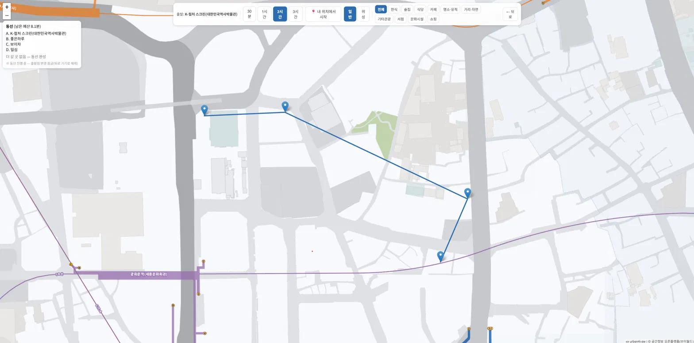
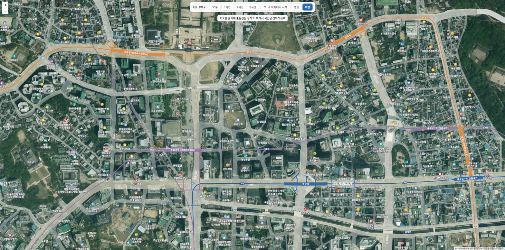
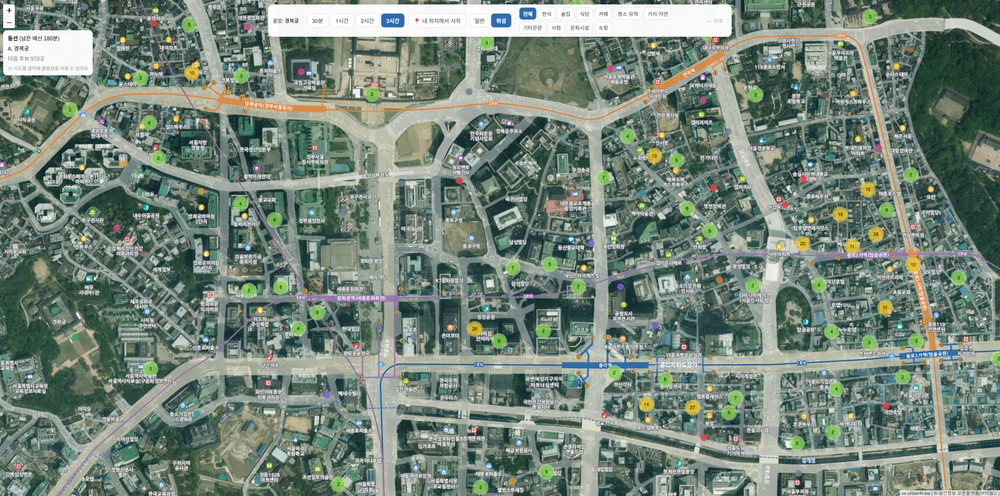

# Jongno Walk-Course Recommender

> Pick a starting point and a walking-time budget, and get a prioritized, sequential A → B → C walking route through Seoul's Jongno district — restaurants, cafés, attractions, bookstores, museums, and shops, all reachable on foot within your budget.

**[🇰🇷 한국어 README](./README.ko.md)**

[](https://urbsn4i-sw.github.io/jongno-walkcourse/)
[](./LICENSE)


**🔗 Live demo: https://urbsn4i-sw.github.io/jongno-walkcourse/**

<!-- Screenshots: capture from the live demo and drop into docs/, then they'll render here -->
<!--



-->

---

## What it does

On a map of Jongno-gu, you choose a starting point and a walking-time budget (30 min / 1 h / 2 h / 3 h). The app shows every spot reachable on foot within that budget, ranked by priority. You pick one; the remaining budget is decremented and a fresh set of reachable candidates appears, chaining into a complete A → B → C route until the budget runs out — with variable depth.

- **Reachability is deterministic**: a candidate passes only if `travel_time + stay_time ≤ remaining budget`.
- **Ranking is where ML lives**: candidates that pass the budget filter are ordered by a learned ranker (see [NN/ML](#nnml-experiments)).
- Travel time is computed from a real pedestrian network (distance ÷ 4.5 km/h).

## Key features

- **Sequential route building** — A → B → C chaining with variable depth, plus undo (budget is restored).
- **Flexible start** — click anywhere on the map or use GPS; the point snaps to the nearest reachable node.
- **10 category filters** — Korean food, bars, other restaurants, cafés, landmarks, streets/nature, other tourism, **bookstores, cultural facilities, shopping**.
- **Marker clustering** with spiderfy, so dense areas (e.g. a single building with many restaurants) stay legible.
- **Standard ↔ satellite** map toggle.
- **Jongno boundary** overlay; routes may cross into adjacent districts when the budget is large.

## Architecture

```
(A) Data layer        Jongno POI table (features) + pedestrian OD matrix      [done, 981 nodes]
(B) Reachability       OD[current][cand] + stay[cand] ≤ remaining budget       [done, deterministic]
(C) Scoring / ranking  orders the candidates that passed (B)  ← NN/ML lives here
(D) Web UI             map + controls + priority markers + route + click loop  [done]
```

The hard constraint (time budget) is enforced exactly by (B); within that, (C)'s ranker only decides the order.

## Data pipeline

981 nodes for Jongno-gu, built from a fully scripted, reproducible pipeline:

- **POIs** collected via the Kakao Local API + TourAPI tourism anchors (e.g. Jongmyo, Jogyesa).
- **Popularity** approximated from Naver blog mention counts (quoted `"name" district` search to avoid false matches).
- **Hotspot score** from winsorized mentions + DBSCAN density, with per-category quotas and stop-word guards against generic-name inflation.
- **Walking OD matrix** (981 × 981 minutes) built from a local Geofabrik PBF via pyrosm + NetworkX shortest paths, snapping each node to the **giant connected component** (isolated-island nodes would otherwise be unreachable).
- Data expansion later added bookstores, cultural facilities, and shopping landmarks incrementally (Kyobo Book Centre, museums, markets) without recomputing the whole matrix.

## NN/ML experiments

The recommendation task is framed as next-POI ranking and validated on the public Foursquare NYC check-in dataset (227k check-ins, 1,083 users), evaluated leave-one-out on a fixed 403-sample test set with Recall@k and NDCG@k. The structure is then applied to Jongno as a demonstration.

| Model | R@1 | R@10 | NDCG@10 |
|---|---|---|---|
| Most-popular | 0.003 | 0.025 | 0.014 |
| Personal history | 0.273 | 0.635 | 0.464 |
| Random Forest | 0.184 | **0.705** | 0.421 |
| Logistic Regression | 0.184 | 0.618 | 0.395 |
| KNN | 0.057 | 0.591 | 0.273 |
| NN L1 (MLP) | 0.442 | 0.529 | 0.489 |
| **NN L2 (MLP + history embedding)** | **0.529** | 0.650 | **0.593** |
| NN L3 (LSTM, sequence) | 0.169 | 0.360 | 0.266 |

**Findings.** NN L2 wins on precision-oriented metrics (Recall@1, NDCG) — the metrics that matter most for recommendation — while Random Forest has the broadest Recall@10 coverage. Sequence modeling (L3, LSTM) underperformed badly: visit *order* turned out to be unhelpful, even harmful, because the dominant signal is the *set* of places a user frequents, not the order. The champion is **NN L2**, illustrating that a more complex model is not always better. Full ablation in [`notebooks/`](./notebooks).

## Tech stack

- **Frontend**: React 19, Vite 8, react-leaflet 5, Leaflet 1.9, react-leaflet-cluster 4.1
- **Map tiles**: VWorld (Korean labels) — standard + satellite
- **Data / geo**: Python 3.12, pyrosm, NetworkX, pandas, GeoPandas
- **ML**: PyTorch, scikit-learn (trained in Google Colab)
- **Deploy**: GitHub Pages (static, pre-computed JSON)

## Run locally

```bash
# Frontend
cd frontend
npm install
npm run dev          # http://localhost:5173

# Build & deploy (GitHub Pages)
npm run deploy
```

The data pipeline scripts live in [`scripts/`](./scripts); each step writes intermediate artifacts consumed by the next. Raw data and API keys are git-ignored.

## Data sources & license

POI data from Kakao Local API and TourAPI; mention counts from the Naver Blog Search API; map tiles from VWorld (공간정보 오픈플랫폼); pedestrian network from OpenStreetMap via Geofabrik. NN methodology validated on the Foursquare NYC check-in dataset (Yang et al., 2014).

Released under the [MIT License](./LICENSE).
